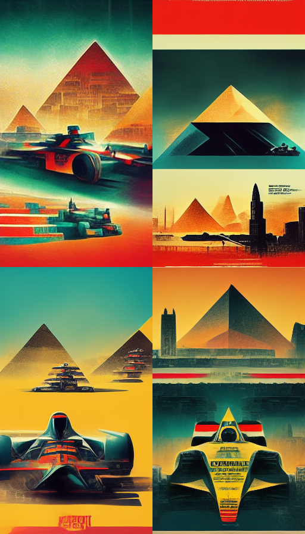

# 0xCairo
The second race of the year brings you to Cairo. 
Start of a new onchain esport

## Season

Each weekend before the next F1 race we will be having our own 0xCairo races.
Friday evenings will begin with qualifier race lasting until Sundays Championship. 
On Sunday the top 20 cars will race for the championship.
The Car with the highest rating will then win the race with potential prizes.

The season will have a constructors cup Championship similiar to F1 where 
the teams (hope is to have each Starknet dapp submit a car) will earn points for each
place in the races leading up to the end of season.

Teams registered to the constructors cup can have total of 2 cars earn points for each race.

Car in first place recieves 25 pts, second 18 pts, 15, 12, 10, 8, 6, 4, 2, 1 for positions 3 through 10 
similiar again to F1 points system.

## Gameplay

Friday qualifiers will have unlimited number of pit stops allowing teams to redeploy cars code.
Sunday (if u make it there) will only allow for 3 pit stops so prepare accordingly.

Submit cairo contract of your bot to the main tournament contract

Gameplay will be similiar to 0xMonaco

### Why Race

For glory, for profit, for fun

Aston Martin, Ferrari, Mercedes, etc. all sell consumer products but compete to be the fastest car at F1.
Opensea was the winners of 0xMonaco but who will be the best Cairo Engineers.
Prove onchain your team has the best and brightest engineers.

https://twitter.com/_0xlime/status/1562510784835776512

### Monetization

- Have teams submit payment with car
- Sponsorships

#### Inspiration

- 0xMonaco by Paradigm
- tournament structure inspired by onlydust starkonquest 
